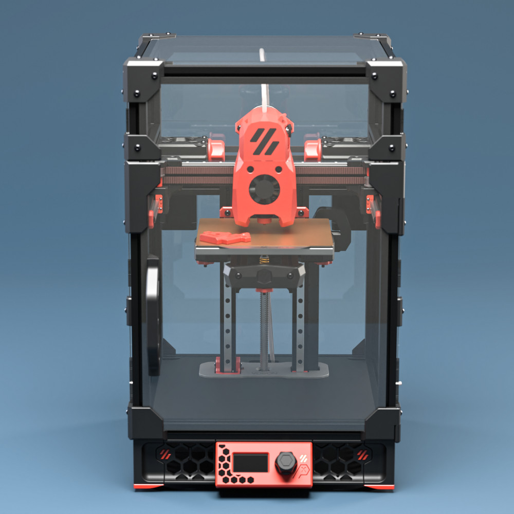
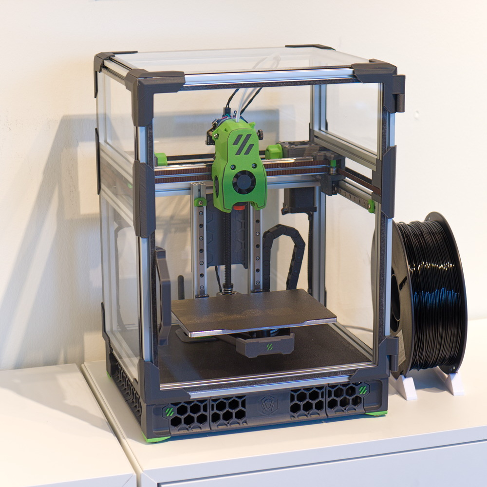

# Voron Zero - No mid panel mod

&nbsp; 

&nbsp; 

&nbsp; 

## Description
Mod for the Voron Zero that does away with the mid panel and replaces it with a printed brace.

## Status
This mod is in alpha/beta. It has only been built by me so far. There are some known issues listed below that may or may not be fixed at some point...

## Print settings
Print according to official Voron [print settings](https://docs.vorondesign.com/sourcing.html#print-settings).

## Bom
* Transparent back panel.
* Meanwell IRM-90-24ST power supply
* Crydom ED24C3 solid state relay
* Bigtreetech Manta E3EZ (SKR Pico + RPi stacked vertically also works)
* AC Powered bed heater
* 2x M3x35 BHCS
* 9x M3x8 BHCS
* 2x M3x6 BHCS
* 9x M3 Nut
* 8x M3 Brass heatstake inserts - short M3x5x4

## Z frame bracket
The trick to this mod is a printed bracket that connects the z extrusions to the back extrusion. It uses two M3x35 screws for rigidity instead of the lower blind joint screw pair in the stock version.
 
&nbsp; 

&nbsp; 

## Build information
It is a fairly involved mod that requires replacing the power supply and heater from the stock BOM. It's probably best suited if you are building a self sourced v0 from scratch.

You need a working printer with a build surface that is large enough to print the 200x200mm deck panel.

The mod is designed to be as compatible as possible with other v0 mods. It retains as much as possible of the original parts.

All the electronics are moved to the bottom bay. This requires using a compact control board setup, a Meanwell IRM-90 power supply and an AC bed heater with a compact Crydom SSR.

This mod is somewhat finicky to assemble. You need to thread the deck panel and the cover plate over the z extrusions before you put the z brace in place. Here are some images go give you an idea of how the parts come together.

&nbsp; 

&nbsp; 

The printed deck panel has tabs for mounting to the bottom frame. The tabs allow for some flex to make sure the panel is rigidly mounted even if it is not exactly to size. It also has holes that allows the wires from the AB motors and toolhead to be passed through from the chamber to the electronics bay (see image below).

In the original V0 design the deck panel sits in the slot in the bottom frame. In this design the deck panel sits flush with the top of the extrusions in the bottom frame instead. You may loose a few millimiters of z-travel unless you are using a kirigami bed with a 6mm build plate and shorter bed screws.

I use this mod for a v0 build with a 170x120mm build plate (see image below). The 50mm wider frame size makes it easier to fit the compnents into the electronics bay. As far as I can tell the setup with an E3EZ should fit the stock size as well, but this is untested for now, so please do you own measurments before attempting this mod. The parts marked 170 in the stl folder is for a 170mm x build.

I recommend using a 2nd accent color for the deck panel cover if black is used as primary color.

This mod replaces the lower and upper back panel with a single transparent panel. There is no need to split these any more as there is no electronics bay in the back that requires access.

It is recommended to combine this mod with some type of fan skirt mod or to add a fan in the electronics bay (see issues).

## Chamber wiring
This image shows the intended routing of cables from the AB motors and toolhead to the electronics bay. There are cutouts in the deck panel to allow wires/cables to be passed through.

&nbsp; 

&nbsp; 

## Electronics bay
There are several controller boards/Pi configurations that will fit this mod. Just make sure to do some planning and measure twice oin the CAD model before you order parts.

You will have to find mounting brackets for your choice of components by yourself. I used a E3EZ with a CM4 in my build. There are STLs for the brackets for the IRM-90 and the E3EZ in the STLs folder. I stuck everything down to the deck panel with VHB tape.

Here is a youtube video by Steve Peterson where he builds a stock voron v0 with similar components for reference:

Note that he uses Reprap firmware with this build and thus he does not need a Raspberry Pi.

&nbsp; 

&nbsp; 

## Picture of build
Here is a picture of my build. It has a 170x120mm build area. That helps in fitting everything into the electronics bay, but from what I can measure it should work with a standard v0 as well.

I combined this with my quad cam lock mod that uses custom zero panels.

&nbsp; 

&nbsp; 

## Known issues
* The inner pair of screws that hold the z frame bracket to the rear extrusion are tricky to reach. There are access holes for the allen key but it can be finicky...
* A split deck panel and cover would be good to simplify assembly/disassembly
* The electronics bay gets hot during pringing. I run AB motors at 0.5A RMS and Z motor at 0.3A RMS to keep things cool and sensorless homing from acting up. Probably need to add a fan somewhere in the electronics bay. There are fan skirt mods for the V0 that should fit this mod as well.
* Having the AB motors inside the enclosure makes sensorless homing more finicky to set up as the threshold values tend to vary with motor temperature.

## Disclamer
If you build this you do so at your own risk. I am not responsible if the design is incorrect or if something goes wrong. Please do your own research and act responsibly.

## Contact
Feel free to contact me here on github or as monkeyPan on the Voron Discord channel if you have questions or if you find any issues.

## Credit
Credit goes to the Voron Team for the original Voron Zero design. 
[Voron team](https://github.com/VoronDesign/) 

This project was inspired by the Itsy Bitsy printer by tigran on the Doomcube Discord channel. 
[Itsy Bitsy by tigran](https://github.com/TigranDesigner/Voron-Mods/tree/main/Itsy%20Bitsy)

